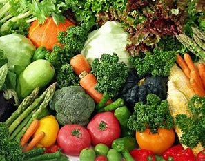
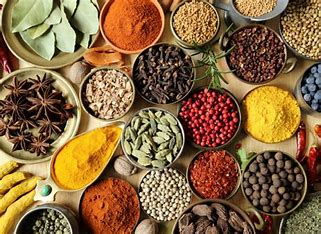
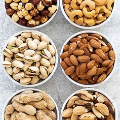
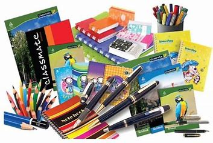
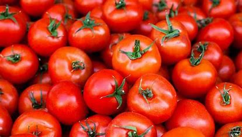
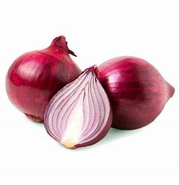
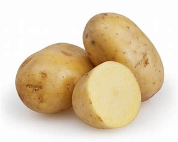

# Grocery
<!DOCTYPE html>
<html>
<head>
    <title>GROCERIES</title>
    <link rel="icon" href="html1.jpg">

</head>
<body>
    

   <h1>💥...VINISHA NELLAI STORE...💥</h1>
   <h2 style="color: brown;"> 🌶️The Enchantig To Buy🌶️</h2>
   <h3>FRESH|GOOD|LOW</h3>

 "Fresh produce, essential goods, friendly service." How's that for a concise grocery shop description? 😄
    

          
    

    
A 🛒 grocery shop is a bustling place where the community comes together to meet their daily needs.Shelves stocked with a variety of fresh produce 🍎, dairy 🥛, meat 🍖, and pantry staples🥫 create a colorful and inviting atmosphere. It's more than just a store; it's a vital part of local life, where neighbors greet each other 👋, families plan meals 🍽️, and children learn about different foods 🍉. The friendly staff offers personalized service, making the shopping experience pleasant and efficient 😊. From fresh fruits and vegetables 🥦 to household essentials 🧻, a grocery shop is a cornerstone of daily living, offering convenience and connection 🌟.
        

        

        

            <h1 style="color: brown;">PRICE DETAILS</h1>
        

        

            <table border="2" width="1000">
                
              <tr>
                <td>items</td> <td>price per kg</td> <td>quality</td>
              </tr>
              <tr>
                <td><centre> </centre></td> <td>  60.00 </td> <td>moderate</td>
              </tr>
              <tr><td></td> <td>90.00</td> <td>good</td></tr>
              <tr><td></td> <td>75.00</td> <td>best</td></tr>
              <tr><td></td> <td>60.00</td> <td>suberb</td></tr>
              <tr><td></td> <td>47.00</td> <td>moderate</td></tr>
            </table>
        
        
The above mentioned are the sample datas if you want to know more about visit the store.

        

        

        

            <table border="2" width="700">
            <tr> <td>14th STREET BUNGALA PUDUR ROAD KANGAYAM,638701</td></tr>
            <tr><td>9876543021|kjh@gmail.com|kangayam</td></tr>
        

    </table>
    <h3>VIEW AS ON</h3>
        <a href="https://www.bing.com/images/search?q=tomato&form=HDRSC3&first=1">|📧|</a> <a href="https://emojipedia.org/">|🌐|</a>
</body>
</html>
